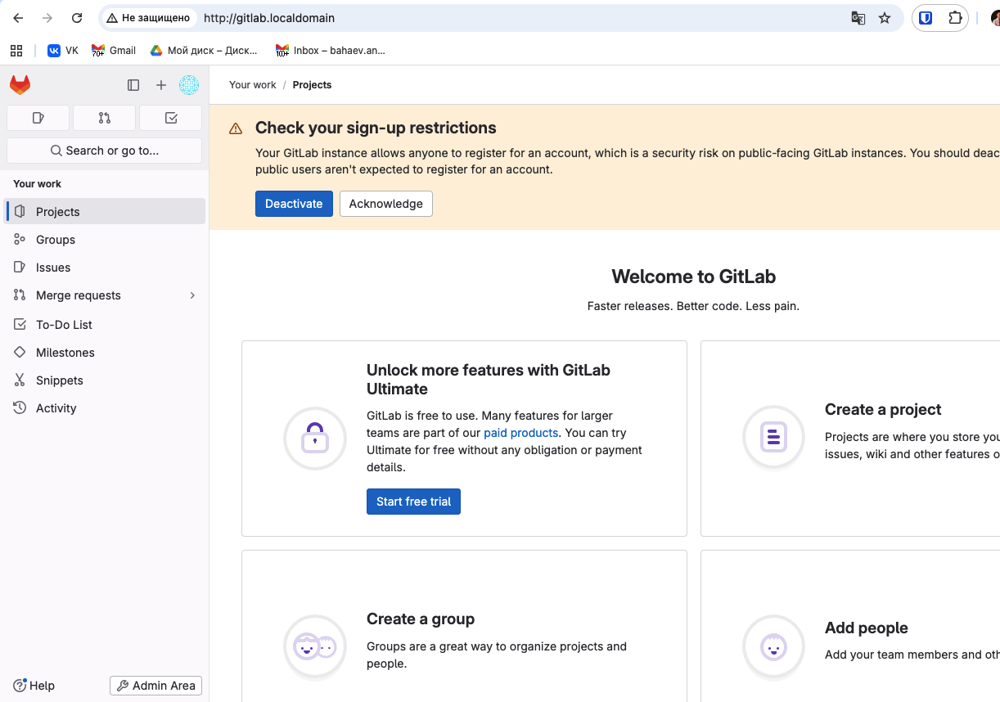
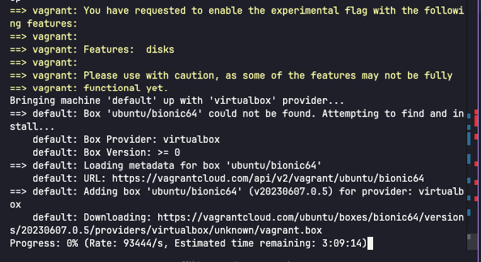
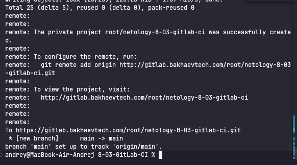
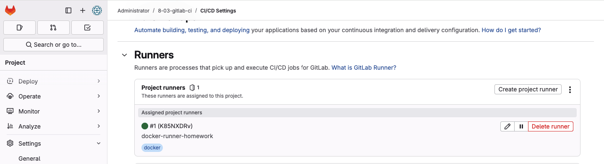
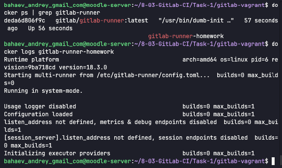

# Домашнее задание к занятию "GitLab CI/CD" - Бахаев Андрей

### Инструкция по выполнению домашнего задания

   1. Сделайте `fork` данного репозитория к себе в Github и переименуйте его по названию или номеру занятия, например, https://github.com/имя-вашего-репозитория/git-hw или  https://github.com/имя-вашего-репозитория/8-3-gitlab-ci-hw).
   2. Выполните клонирование данного репозитория к себе на ПК с помощью команды `git clone`.
   3. Выполните домашнее задание и заполните у себя локально этот файл README.md:
      - впишите вверху название занятия и вашу фамилию и имя
      - в каждом задании добавьте решение в требуемом виде (текст/код/скриншоты/ссылка)
      - для корректного добавления скриншотов воспользуйтесь [инструкцией "Как вставить скриншот в шаблон с решением](https://github.com/netology-code/sys-pattern-homework/blob/main/screen-instruction.md)
      - при оформлении используйте возможности языка разметки md (коротко об этом можно посмотреть в [инструкции  по MarkDown](https://github.com/netology-code/sys-pattern-homework/blob/main/md-instruction.md))
   4. После завершения работы над домашним заданием сделайте коммит (`git commit -m "comment"`) и отправьте его на Github (`git push origin`);
   5. Для проверки домашнего задания преподавателем в личном кабинете прикрепите и отправьте ссылку на решение в виде md-файла в вашем Github.
   6. Любые вопросы по выполнению заданий спрашивайте в чате учебной группы и/или в разделе "Вопросы по заданию" в личном кабинете.
   
Желаем успехов в выполнении домашнего задания!

### Дополнительные материалы, которые могут быть полезны для выполнения задания

1. [GitLab материалы](https://github.com/netology-code/sdvps-materials/tree/main/gitlab)
2. [Руководство по оформлению Markdown файлов](https://gist.github.com/Jekins/2bf2d0638163f1294637#Code)

---

### Задание 1

**Разверните GitLab локально, используя Vagrantfile и инструкцию, описанные в репозитории.**

1. Скачайте материалы из репозитория задания
2. Разверните GitLab через Vagrant
3. Создайте новый проект и пустой репозиторий
4. Зарегистрируйте gitlab-runner для проекта в режиме Docker
5. Приложите скриншоты с настройками раннера

**Файлы для выполнения «Задание №1» (в папке `Task-1`):**
- [README.md](./Task-1/README.md) - подробные инструкции по выполнению
- [gitlab-vagrant/](./Task-1/gitlab-vagrant/) - файлы для Vagrant (Vagrantfile, docker-compose.yaml, GITLAB.md)
- [quick-start.sh](./Task-1/quick-start.sh) - скрипт быстрого старта
- [screenshots/](./Task-1/screenshots/) - скриншоты процесса выполнения

**Скриншоты выполнения:**




---

### Задание 2

**Запушьте репозиторий на GitLab и создайте .gitlab-ci.yml**

1. Измените origin на GitLab репозиторий
2. Создайте .gitlab-ci.yml с необходимыми этапами
3. Запушьте изменения
4. Приложите файл .gitlab-ci.yml и скриншоты успешных сборок

**Файлы для выполнения «Задание №2» (в папке `Task-2`):**
- [README.md](./Task-2/README.md) - инструкции по настройке
- [quick-start.sh](./Task-2/quick-start.sh) - скрипт настройки репозитория
- [screenshots/](./Task-2/screenshots/) - скриншоты успешных сборок

**Файл .gitlab-ci.yml:**
```yaml
stages:
  - build
  - test
  - deploy

build_job:
  stage: build
  tags:
    - docker
  script:
    - echo "Сборка проекта..."
    - echo "Установка зависимостей..."
    - echo "Компиляция завершена"

test_job:
  stage: test
  tags:
    - docker
  script:
    - echo "Запуск тестов..."
    - echo "Unit тесты прошли"
    - echo "Интеграционные тесты прошли"

deploy_job:
  stage: deploy
  tags:
    - docker
  script:
    - echo "Деплой в production..."
    - echo "Деплой завершен успешно"
```

**Скриншоты выполнения:**



**Скриншоты пайплайна (для сдачи Task-2):**
- build: `Task-2/screenshots/build.png`
- test: `Task-2/screenshots/test.png`
- deploy: `Task-2/screenshots/deploy.png`

---

**Ссылка на GitHub проект:** https://github.com/bakhaev-andrey/netology_homework/tree/github-main/%D0%90%D0%B2%D1%82%D0%BE%D0%BC%D0%B0%D1%82%D0%B8%D0%B7%D0%B0%D1%86%D0%B8%D1%8F%20%D0%B8%20CI-CD